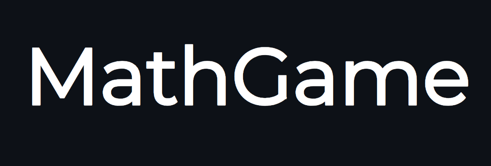
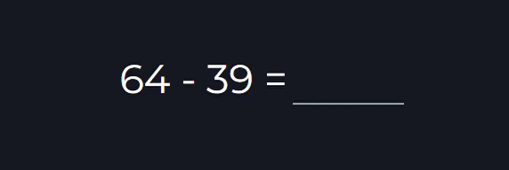

**MathGame** - веб-приложение для тренировки устного счета. Для погружения в состояние потока на сайте отсутствует кнопка подтверждения ответа. При верном решении пример сменится на следующий

Уже в приложении:

- 3 режима игры
- Гибкие настройки для игровой сессии
- Личный аккаунт со статистикой
- Модификаторы для усложнения сессии
- Сиды для повторения и воспроизведения сессий
- 5 цветовых тем

Приложение в разработке. Скоро будут добавлены:

- Уровень профиля
- Подробная статистика в личном кабинете
- База знаний с советами для устного счета
- Новые режимы игры
- Английский язык
- Система достижений

---

**MathGame** is a web application for practicing mental arithmetic. There is no answer confirmation button on the site to dive into the flow state. If the solution is correct, the example will change to the next one

Already in the app:

- 3 game modes
- Flexible settings for game session
- Personal account with statistics
- Modifiers to make the session more difficult
- Seeds for repeating sessions
- 5 color themes

Application in development. It will be added soon:

- Account level
- Detailed statistics in your account
- Knowledge base with tips for mental math
- New game mods
- English language
- Achievement System
