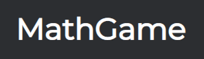

**MathGame** - кастомное веб-приложение для тренировки устного счета.

Приложение находится на стадии разработки. В ближайшее время будет добавлено:

- Уровень профиля
- Подробная статистика в личном кабинете
- База знаний с советами для устного счета
- Новый режим игры

---

**MathGame** is a custom web application for practicing mental arithmetic.

Application in development. It will be added soon:

- Account level
- Detailed statistics in the personal account
- Knowledge base with tips for mental math
- New game mode
